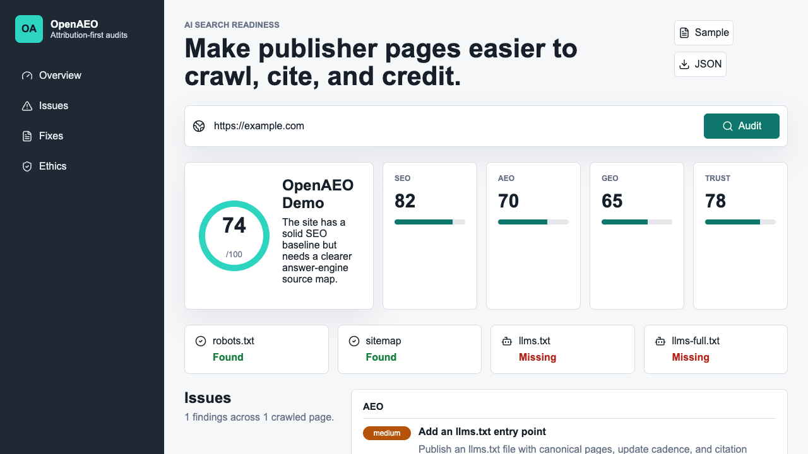

# OpenAEO

**OpenAEO is an open-source toolkit for making publisher websites crawlable, citeable, and attribution-ready for AI answer engines.**

Search is moving from blue links into generated answers. That is useful for readers, but it creates a real maintenance problem for the open web: publishers spend time researching, documenting, correcting, and updating pages, while answer interfaces need clearer ways to identify canonical sources and credit them accurately.

OpenAEO is built around a practical bargain: if publishers expose cleaner source maps, better metadata, stronger citations, and explicit attribution preferences, AI answer engines can retrieve better material, answer with more confidence, and preserve more context about the people who made the source.

That helps the AI ecosystem and the site owner at the same time. Answer products get healthier, more structured web data. Publishers get a transparent way to make useful pages easier to understand, cite, and credit.

OpenAEO takes that side. It helps site owners prepare for an AI-search world where good sources are easier to understand, easier to cite, and easier to credit.

OpenAEO helps both sides of that bargain.

- Publishers get a free, transparent way to audit AI-readiness.
- ChatGPT-style answer engines get cleaner source maps, stronger metadata, and easier citation paths.
- The open web gets tooling that optimizes clarity and attribution instead of spam.



## What It Does

- Crawls a site respectfully with robots.txt and sitemap awareness.
- Audits classic SEO signals: titles, descriptions, canonicals, headings, links, status codes.
- Audits AEO/GEO signals: `llms.txt`, `llms-full.txt`, schema.org JSON-LD, answer blocks, citations, author/source metadata, freshness, and internal source paths.
- Generates JSON and Markdown reports.
- Generates practical fixes such as starter `llms.txt`, JSON-LD templates, and citation block patterns.
- Uses the OpenAI API for model-generated recommendations when `OPENAI_API_KEY` or `--openai-api-key` is provided.
- Includes deterministic mock mode only for CI, tests, and local demos without secrets.
- Includes a Next.js dashboard for viewing sample reports and running local audits.
- Blocks private-network crawl targets by default to reduce SSRF risk in hosted deployments.

## Quick Start

```bash
npm install
npm run build
npm run test
```

Run an audit:

```bash
OPENAI_API_KEY=sk-... npm exec openaeo -- audit https://example.com --max-pages 8 --out reports
```

Start the dashboard:

```bash
npm run dev
```

Then open `http://localhost:3000`.

## Public Roadmap

OpenAEO is early, but the direction is intentionally practical: help publishers stay useful and credited as AI search becomes the default discovery layer.

### v0.1 - Source Readiness Foundation

- [x] CLI audit command with JSON and Markdown report exports
- [x] Next.js dashboard for viewing and running audits
- [x] Respectful crawler with robots.txt, sitemap, and crawl-limit support
- [x] SEO/AEO/GEO/trust scoring rules
- [x] `llms.txt`, schema.org, citation, freshness, author, and answer-block checks
- [x] OpenAI API analysis for model-generated recommendations
- [x] Deterministic mock AI mode for tests and demos

### v0.2 - Better Publisher Workflows

- [ ] Add report comparison between audit runs
- [ ] Add more schema templates for Article, FAQPage, Product, Organization, SoftwareApplication, and Dataset
- [ ] Add broken-link and redirect-chain reporting
- [ ] Add configurable crawl budgets and URL include/exclude patterns
- [ ] Add exportable GitHub Actions templates for scheduled audits
- [ ] Add a public gallery of anonymized example reports

### v0.3 - AI Visibility Experiments

- [ ] Add prompt-set testing for brand/entity visibility
- [ ] Track citation opportunities where competitors are cited and the audited site is not
- [ ] Add OpenAI-powered prompt-set experiments for answer visibility and citation readiness
- [ ] Add drift reports for changed answers, citations, and source positions
- [ ] Add a plugin API for custom scoring rules

### v1.0 - Maintainer-Grade Open Web Toolkit

- [ ] Stable npm package and semver policy
- [ ] Persistent local project history
- [ ] Team-ready dashboard deployment guide
- [ ] Security hardening for hosted audit APIs
- [ ] Documentation site with recipes for publishers, docs teams, journalists, and open-source maintainers

## Project Health

- MIT licensed with a documented [security policy](SECURITY.md), [contribution guide](CONTRIBUTING.md), and [maintainer responsibilities](MAINTAINERS.md).
- CI runs lint, typecheck, tests, and production build on every push and pull request.
- Dependabot monitors npm and GitHub Actions updates weekly.
- Releases are tracked in [CHANGELOG.md](CHANGELOG.md) and prepared with the [release process](docs/release-process.md).
- Core demos and tests run in deterministic mock mode without committing API keys.

## Example Output

```text
OpenAEO score: 74/100
Pages crawled: 5
Issues found: 9
Reports: /path/to/reports/openaeo-report.json, /path/to/reports/openaeo-report.md
```

The Markdown report includes:

- category scores for SEO, AEO, GEO, and trust
- prioritized issues
- evidence and recommendations
- generated fixes
- ethical crawl stance

See [sample reports](examples/sample-reports/README.md) for public-site output.

## Why This Matters To AI Search

AI answer engines need the best possible source material. The web gets worse when publishers feel invisible, scraped, or replaced. OpenAEO focuses on the maintenance layer that makes attribution possible: canonical URLs, source maps, structured data, freshness, and evidence near claims.

ChatGPT and other answer products can build more durable trust when useful source pages are easy to discover and cite. For that to work, publishers need open tooling that helps them provide clean, canonical, attribution-ready data.

OpenAEO is not a trick for gaming rankings. It is infrastructure for source clarity:

- canonical URLs instead of duplicate ambiguity
- author and publisher identity instead of anonymous claims
- dates and review signals instead of stale answers
- citations near factual claims instead of unsupported summaries
- `llms.txt` source maps instead of crawler guesswork

That makes answer systems better because the underlying web data becomes more structured, attributable, and trustworthy. It also gives site owners a practical checklist: publish cleaner source maps, expose better metadata, and make attribution easier.

OpenAEO is pro-publisher and pro-answer-quality for the same reason: the best AI search products need the best open-web sources, and the best sources only keep existing when creators can see a path to recognition and credit.

## Maintainer Workflow Fit

OpenAEO is built for the maintenance work that AI-era publishers and open-source docs teams now have to do: keep source pages crawlable, fresh, structured, cited, and attribution-friendly.

Better publisher metadata means better retrieval, better answers, and better credit loops for the people maintaining the web. OpenAEO turns that into maintainer work that can be reviewed in pull requests: audit rules, fixtures, generated reports, release notes, documentation, and security hardening.

Codex and OpenAI API credits would be used for audit-rule development, fixture generation, PR review, release automation, security review, and OpenAI-powered optional recommendations.

Short application summary:

> OpenAEO helps keep the open web useful for ChatGPT by giving publishers open tooling to expose canonical sources, `llms.txt`, structured data, citations, freshness, and attribution metadata. It improves source quality for OpenAI-style retrieval while helping creators remain visible and credited.

## Monorepo Structure

```text
apps/web              Next.js dashboard
packages/cli          openaeo audit <url>
packages/crawler      respectful site crawler
packages/audit        scoring, rules, fixes, AI analysis
packages/schemas      shared Zod schemas and sample report
docs                  launch notes, scheduled audit docs, and assets
examples/fixtures     local fixture site for validation
```

## CLI

```bash
openaeo audit <url> [options]
```

Options:

```text
--max-pages <number>     Maximum same-origin pages to crawl
--out <directory>        Report output directory
--mock-ai                Use deterministic mock analysis instead of the OpenAI API
--openai-api-key <key>   OpenAI API key; defaults to OPENAI_API_KEY
--model <model>          OpenAI model
--project-name <name>    Human-readable project name
--allow-private-network  Allow localhost/private-network targets for trusted local fixtures
```

## OpenAI API Analysis

OpenAEO uses the OpenAI API for model-generated recommendations. Set `OPENAI_API_KEY` or pass `--openai-api-key`:

```bash
npm exec openaeo -- audit https://example.com \
  --openai-api-key "$OPENAI_API_KEY" \
  --model gpt-5-mini
```

Mock mode exists for CI, tests, and local demos where secrets should not be required:

```bash
npm exec openaeo -- audit https://example.com --mock-ai
```

## Ethical Stance

OpenAEO does not ship spam workflows, dark-pattern crawling, cloaking guidance, or ranking manipulation. It optimizes for clarity, provenance, and attribution.

Responsible defaults:

- respect robots.txt
- cap crawl depth/page counts
- prefer canonical source pages
- encourage visible citations and dates
- keep generated fixes reviewable by humans

## Contributing

OpenAEO needs new audit rules, site fixtures, schema examples, docs, and real-world reports. Start with `CONTRIBUTING.md`.

## License

MIT
